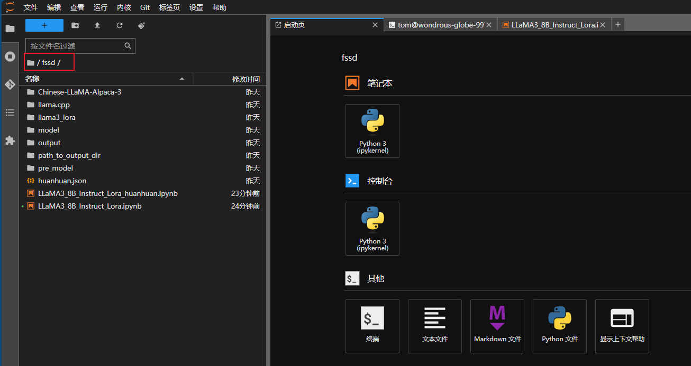

# persimmons-huanhuan-chat

## 概述

手把手 演示 llama-3-8b-instruct 微调一个 嬛嬛-Chat mvp版本的过程 以及 LLM数据集生成

-  [LLaMA3_8B_Instruct_Lora_huanhuan.ipynb](LLaMA3_8B_Instruct_Lora_huanhuan.ipynb) ：微调过程
-  [generation_dataset](generation_dataset) ：需要LLM生成数据集，查看此脚本
-  [Getting_to_know_Llama.ipynb](Getting_to_know_Llama.ipynb) :了解 Llama 3：开始构建所需的一切

## 微调环境

- [算力互联 - 控制台](https://console.casdao.com:9001/#/overview)：4090D-24G

## 微调过程

1. 先充值：5块，新注册后领取5块抵50卷，然后使用，充值

2. 购买机器：

   

   

   根据提示填写端口号，然后直接创建实例

3. 回到实例

   

4. 打开实例的 Jupyter

   

5. 双击进入 fssd目录

   

6. 双击 进入终端

   

7. 克隆项目

   ```bash
   git clone https://github.com/a-persimmons/persimmons-huanhuan-chat.git
   
   cp persimmons-huanhuan-chat/LLaMA3_8B_Instruct_Lora_huanhuan.ipynb .
   ```

8. 双击打开微调脚本 *LLaMA3_8B_Instruct_Lora_huanhuan.ipynb*

9. 开始微调，按步骤一步一走

## 本地“安装”模型和设置

1. 下载模型

   单机 这个图标

   

   进入fsas 目录

   

   单机右键 选择下载即可

   

2. 本地部署模型

   1. 安装ollama，根据你的系统进行下载安装：[ollama.com/download](https://ollama.com/download)，然后打开终端命令行`ollama serve`或图标（mac/win）启动

   2. 复制刚刚下载的gguf文件名（不要.gguf后缀）

   3. 在你下载的gguf的同级目录下，创建一个文件Modelfile，然后输入以下内容：

      ```bash
      FROM <刚刚复制的文件名>.gguf
      TEMPLATE """{{ if .System }}<|start_header_id|>system<|end_header_id|>
      
      {{ .System }}<|eot_id|>{{ end }}{{ if .Prompt }}<|start_header_id|>user<|end_header_id|>
      
      {{ .Prompt }}<|eot_id|>{{ end }}<|start_header_id|>assistant<|end_header_id|>
      
      {{ .Response }}<|eot_id|>"""
      PARAMETER stop "<|start_header_id|>"
      PARAMETER stop "<|end_header_id|>"
      PARAMETER stop "<|eot_id|>"
      PARAMETER stop "<|reserved_special_token"
      ```

    4. 打开终端，cd 到刚刚下载的gguf目录下，或在此目录下打开终端（支持的话）

    5. 执行”安装“gguf模型命令：

       ```bash
       ollama create <刚刚复制的文件名>:8b -f ./Modelfile
       ```

    6. 加载完成，看见success就是“安装”完成。

    7. 查看“安装”的模型列表：

       ```bash
       ollama list
       ```

    8. 测试模型：

       ```bash
       ollama run <复制 ollama list中NAMA列的全名称（包含:后面的）>
       ```

    9. 然后和他像在ChatGPT一样，和他对话，比如“你是谁”

    10. 结束测试模型：ctrl/control + D

3. 安装Docker(已安装跳过)

   安装完成后，然后注册/登录

   1. Mac：[Install Docker Desktop on Mac | Docker Docs](https://docs.docker.com/desktop/install/mac-install/)
   2. Win：[Install Docker Desktop on Windows | Docker Docs](https://docs.docker.com/desktop/install/windows-install/)
   3. Ubuntu/Linux：[Install Docker Desktop on Linux | Docker Docs](https://docs.docker.com/desktop/install/linux-install/#generic-installation-steps)

4. 安装前端界面（使用像ChatGPT的类界面，本地使用模型），这里使用的是[open-webui/open-webui: User-friendly WebUI for LLMs (Formerly Ollama WebUI) (github.com)](https://github.com/open-webui/open-webui)

   ```bash
   # 有GPU的话使用这个，比如 有nvidia显卡的游戏本 Win/ubuntu
   docker run -d -p 3000:8080 --gpus=all -v ollama:/root/.ollama -v open-webui:/app/backend/data --name open-webui --restart always ghcr.io/open-webui/open-webui:ollama
   
   # 只有CPU的话用这个，比如 mac（Intel）
   docker run -d -p 3000:8080 -v ollama:/root/.ollama -v open-webui:/app/backend/data --name open-webui --restart always ghcr.io/open-webui/open-webui:ollama
   ```

5. 等待安装完成，最后访问：`http://localhost:3030`，随便注册下，进入下面界面：

   

6. 设置连接本地ollama服务

   1. 点开右上角设置图标

      

   2. 设置中文

      

   3. 设置Ollama API 连接：http://host.docker.internal:11434，然后点击旁边的刷新按钮，最后 保存

      

   4. 查看是否连接成功，如下是否能看见之前`ollama list`,看到的模型列表

      


## 开始聊天

1. 回到聊天界面，顶部选择模型，愉快的Chat

   

## 鸣谢

- [KMnO4-zx/huanhuan-chat: Chat-甄嬛是利用《甄嬛传》剧本中所有关于甄嬛的台词和语句，基于ChatGLM2进行LoRA微调得到的模仿甄嬛语气的聊天语言模型。 (github.com)](https://github.com/KMnO4-zx/huanhuan-chat)
- [ymcui/Chinese-LLaMA-Alpaca-3: 中文羊驼大模型三期项目 (Chinese Llama-3 LLMs) developed from Meta Llama 3 (github.com)](https://github.com/ymcui/Chinese-LLaMA-Alpaca-3)
- [datawhalechina/self-llm: 《开源大模型食用指南》基于Linux环境快速部署开源大模型，更适合中国宝宝的部署教程 (github.com)](https://github.com/datawhalechina/self-llm)
- [Llama3-Tutorial/docs_autodl/lmdeploy.md at main · SmartFlowAI/Llama3-Tutorial (github.com)](https://github.com/SmartFlowAI/Llama3-Tutorial)
- https://ollama.com/
